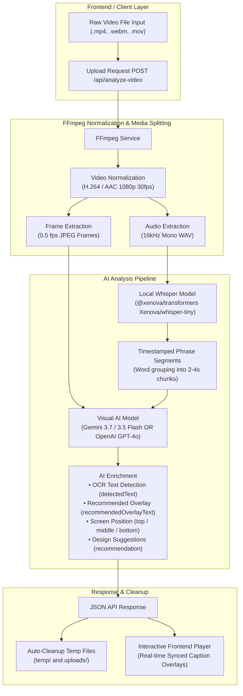

# Caption Generator - Video Processing Architecture & Benchmark Output

This document provides a comprehensive overview of the **Caption Generator** backend pipeline architecture, sequence flow, hosted deployment limitations, and a real sample API response.

---

## 1. Video Processing Pipeline Architecture



---

## 2. Deployment & Free-Tier Infrastructure Limitations

> [!WARNING]
> **1. Render Free-Tier Memory Limit (512 MB RAM)**
> - **Issue**: The free instance tier on Render enforces a strict **512 MB memory limit**.
> - **Cause**: Loading the local Whisper speech-to-text model via `@xenova/transformers` initializes the native ONNX Runtime C++ engine (`onnxruntime-node`). Combining ONNX memory allocations with Node.js V8 heap and FFmpeg encoding processes causes memory usage to exceed 512MB.
> - **Result**: Render's Linux cgroups OOM (Out-Of-Memory) killer terminates the process, resulting in an `Instance failed: Ran out of memory` log and a `502 Bad Gateway` HTTP error.
> - **Recommendation**: Deploy on an instance with at least **1GB – 2GB RAM** (e.g., Render Starter plan) or offload Whisper STT to a cloud API.

> [!IMPORTANT]
> **2. Gemini API Free-Tier Quotas & Rate Limiting (429 / 503)**
> - **Issue**: Using free-tier Gemini API keys (`GEMINI_API_KEY`) frequently triggers rate-limit and high-demand errors:
>   `HTTP 503: This model is currently experiencing high demand. Please try again later.` or `HTTP 429: Resource Exhausted`.
> - **Recommendation**: Use a paid tier Gemini API key or switch the provider toggle to OpenAI (`llm: 'openai'`).

---

## 3. Real Sample API Benchmark Output

Below is the verified response output generated for `DISCIPLINE - Motivational Speech - Ben Lionel Scott (1080p, h264).mp4`:

```json
{
    "success": true,
    "filename": "DISCIPLINE - Motivational Speech - Ben Lionel Scott (1080p, h264).mp4",
    "llmProvider": "gemini",
    "keepTemp": false,
    "captionsCount": 5,
    "captions": [
        {
            "startTime": 0.1,
            "endTime": 2.76,
            "text": "The distance between your dreams and your reality right",
            "screenPosition": "top",
            "detectedText": "The distance between your dreams and your reality right now @BENLIONELSCOTT",
            "recommendedOverlayText": "DREAMS VS REALITY",
            "recommendation": "Use bold, uppercase typography placed at the top to complement the existing center subtitles and avoid silhouette overlap."
        },
        {
            "startTime": 2.76,
            "endTime": 6.06,
            "text": "now is discipline. discipline is",
            "screenPosition": "top",
            "detectedText": "is discipline. @BENLIONELSCOTT",
            "recommendedOverlayText": "IT'S DISCIPLINE",
            "recommendation": "Highlight keyword with high-contrast white text and subtle glow at top center."
        },
        {
            "startTime": 6.06,
            "endTime": 9.42,
            "text": "doing the things you hate to do, but do it like you",
            "screenPosition": "top",
            "detectedText": "Discipline is doing the things you hate to do, @BENLIONELSCOTT",
            "recommendedOverlayText": "DO WHAT YOU HATE",
            "recommendation": "Position bold text at top screen area to maintain focus on the boxer's movement."
        },
        {
            "startTime": 9.42,
            "endTime": 9.6,
            "text": "love",
            "screenPosition": "top",
            "detectedText": "but do it like you love it. @BENLIONELSCOTT",
            "recommendedOverlayText": "LIKE YOU LOVE IT",
            "recommendation": "Use punchy pop-in animation synced to the voice emphasis."
        },
        {
            "startTime": 9.6,
            "endTime": 15.14,
            "text": "it.",
            "screenPosition": "top",
            "detectedText": "but do it like you love it. @BENLIONELSCOTT",
            "recommendedOverlayText": "MASTER THE GRIND",
            "recommendation": "Keep clean modern font style at the top as outro hook while subject shadows box."
        }
    ]
}
```
